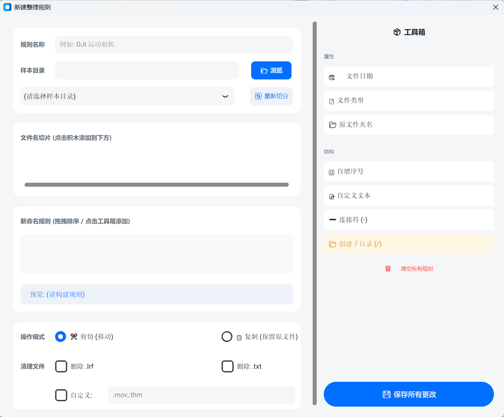

# 📂 文件整理助手 (File Organizer)

一个基于 Python 和 CustomTkinter 开发的现代化文件整理工具。支持可视化搭建整理规则，专为摄影师、视频创作者及需要整理大量文件的用户设计。


## ✨ 主要功能

* **🎨 现代化 UI**: 基于 CustomTkinter 的卡片式设计，支持浅色/深色模式。
* **🧩 可视化规则编辑器**: 像搭积木一样自定义文件命名规则。
* **🛠️ 强大的工具箱**:
    * 支持读取原文件名切片。
    * 支持自动创建层级文件夹（按年/月/日/文件类型）。
    * 支持添加自增序号。
* **⚡ 批量处理**: 多线程执行，支持“剪切”或“复制”模式。
* **🧹 自动清理**: 可自动识别并删除 DJI `.lrf` 临时文件或 `.txt` 等垃圾文件。

## 📸 界面预览

| 规则编辑器 | 智能切片 |
| :---: | :---: |
|  |  |

## 🚀 如何使用

1.  **选择目录**: 设置源文件夹和目标文件夹。
2.  **新建规则**: 点击“新建规则”，进入可视化编辑器。
    * 加载样本文件。
    * 从工具箱拖拽积木构建路径（例如：`[日期] / [类型] / [原文件名]`）。
    * 保存规则。
3.  **开始整理**: 点击主界面的“立即开始整理”。

## 🛠️ 安装与运行

### 方式一：直接运行 (推荐)
前往 [Releases](此处填你GitHub仓库的Releases链接) 下载最新的 `.exe` 版本，解压即用。

### 方式二：源码运行
```bash
# 克隆仓库
git clone [https://github.com/Croydon-MacGyver/FileOrganizer.git]

# 安装依赖
pip install customtkinter

# 运行
python main_app.py

开发环境
Python 3.11

CustomTkinter

Made by Croydon MacGyver
